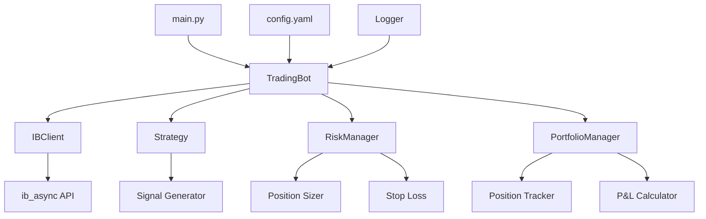

# Architecture Overview

## System Architecture

## Component Overview

### TradingBot (`src/bot.py`)
The main orchestrator class that coordinates all components:
- Manages the main event loop
- Coordinates between IBClient, Strategy, RiskManager, and PortfolioManager
- Handles order execution workflow
- Monitors positions and triggers strategy evaluations

### BacktestEngine (`src/backtest/`)
Backtesting system for strategy validation:
- `BacktestEngine`: Main backtest orchestrator
- `HistoricalDataLoader`: Loads historical data from IB or CSV
- `PerformanceAnalyzer`: Calculates performance metrics
- `TradeVisualizer`: Generates charts and visualizations
- Uses same strategy and risk management as live trading
- Generates comprehensive reports with trade analysis

### IBClient (`src/ib_client.py`)
Wrapper around `ib_async` for Interactive Brokers API:
- Handles connection and reconnection logic
- Provides methods for market data subscription
- Manages order placement and tracking
- Retrieves account information and positions
- Implements error recovery and retry logic

### Strategy (`src/strategy/`)
Abstract base class and implementations:
- `BaseStrategy`: Defines the strategy interface
- `BreakAndRetestStrategy`: Break and retest strategy for support/resistance trading
- Strategies generate buy/sell signals based on market data
- Easy to extend with custom trading logic
- Architecture designed to support multiple strategies in the future

### RiskManager (`src/risk/`)
Risk management and position sizing:
- `RiskManager`: Enforces risk limits and daily loss limits
- `PositionSizer`: Calculates position sizes based on risk parameters
- Manages stop loss orders
- Tracks daily P&L to prevent excessive losses

### PortfolioManager (`src/portfolio/`)
Portfolio tracking and P&L calculation:
- Tracks open positions
- Calculates real-time unrealized P&L
- Records closed positions and realized P&L
- Provides portfolio statistics

### BacktestEngine (`src/backtest/`)
Backtesting system for strategy validation:
- `BacktestEngine`: Main backtest orchestrator
- `HistoricalDataLoader`: Loads historical data from IB or CSV
- `PerformanceAnalyzer`: Calculates performance metrics
- `TradeVisualizer`: Generates charts and visualizations
- Uses same strategy and risk management as live trading
- Generates comprehensive reports with trade analysis

### Utilities (`src/utils/`)
Supporting utilities:
- `logger.py`: Logging setup with file rotation
- `config.py`: Configuration loading from YAML and environment variables

## Data Flow

1. **Initialization**: Bot loads configuration and connects to IB API
2. **Market Data**: IBClient subscribes to real-time market data for configured symbols
3. **Strategy Evaluation**: Bot periodically evaluates strategy for each symbol
4. **Signal Generation**: Strategy generates buy/sell/hold signals
5. **Risk Check**: RiskManager validates if trade is allowed (position limits, daily loss limits)
6. **Position Sizing**: PositionSizer calculates appropriate position size
7. **Order Execution**: IBClient places orders through IB API
8. **Portfolio Update**: PortfolioManager tracks positions and P&L
9. **Monitoring**: Bot continuously monitors positions for exit signals or stop loss triggers

## Error Handling

- Connection failures: Automatic reconnection with exponential backoff
- Order failures: Error logging and retry logic
- Data gaps: Handles missing market data gracefully
- API errors: Comprehensive error handling and logging

## Threading Model

The bot uses asyncio for non-blocking operations:
- All IB API calls are async
- Market data updates are handled asynchronously
- Order execution is non-blocking
- Strategy evaluation runs in async event loop
