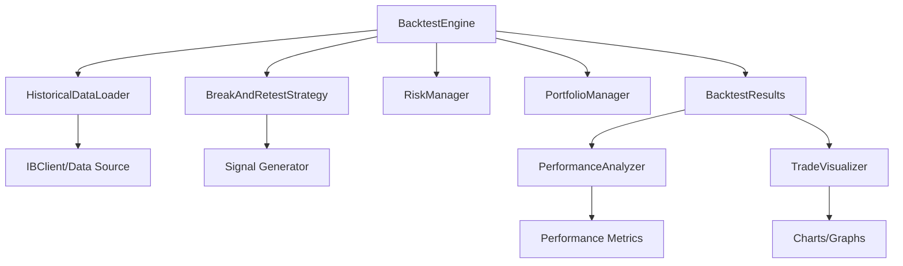

# Backtesting System

## Overview

The backtesting system allows you to test your trading strategy on historical data using the same configuration and strategy logic as live trading. It provides comprehensive analysis and visualizations to help you evaluate strategy performance.

## Features

- **Historical Data Testing**: Test strategies on past market data
- **Same Strategy Logic**: Uses identical strategy code as live trading
- **Performance Metrics**: Win rate, Sharpe ratio, drawdown, etc.
- **Trade Visualization**: Charts showing entry/exit points, P&L
- **Equity Curve**: Visual representation of account growth
- **Trade Analysis**: Detailed breakdown of winning/losing trades
- **Multiple Timeframes**: Test on different timeframes
- **Parameter Optimization**: Test different parameter combinations

## Architecture



## Backtest Configuration

### Stock Config with Backtest Settings

Each stock's configuration file contains both live trading and backtesting settings:

```yaml
# config/stocks/AAPL.yaml

# Stock Information
stock:
  symbol: "AAPL"
  enabled: true
  description: "Apple Inc."

# Strategy Configuration (used for both live and backtest)
strategy:
  name: "BreakAndRetestStrategy"
  min_confidence: 0.6
  break_threshold: 0.005
  # ... other strategy parameters

# Backtesting Configuration
backtest:
  enabled: true
  
  # Date Range
  start_date: "2024-01-01"
  end_date: "2024-12-31"
  
  # Timeframe
  timeframe: "1 hour"  # Bar size: "1 min", "5 min", "15 min", "1 hour", "4 hour", "1 day"
  
  # Data Source
  data_source: "ib"  # "ib" for Interactive Brokers, "csv" for local files
  
  # Commission and Slippage
  commission_per_trade: 1.0  # $1 per trade
  slippage_percent: 0.001     # 0.1% slippage
  
  # Output Settings
  generate_charts: true
  generate_report: true
  save_trades: true
```

### Multiple Stocks with Different Settings

Each stock has its own config file with different backtest settings:

```yaml
# config/stocks/AAPL.yaml
backtest:
  enabled: true
  start_date: "2024-01-01"
  end_date: "2024-12-31"
  timeframe: "1 hour"  # AAPL: 1 hour bars
  # ... other settings

# config/stocks/MSFT.yaml
backtest:
  enabled: true
  start_date: "2024-01-01"
  end_date: "2024-12-31"
  timeframe: "4 hour"  # MSFT: 4 hour bars
  # ... other settings

# config/stocks/TSLA.yaml
backtest:
  enabled: true
  start_date: "2024-01-01"
  end_date: "2024-12-31"
  timeframe: "15 min"  # TSLA: 15 min bars (more volatile)
  # ... other settings
  
  # Walk-Forward Analysis
  walk_forward:
    enabled: false
    train_period: 180  # days
    test_period: 30    # days
    step_size: 30      # days
  
  # Parameter Optimization
  optimization:
    enabled: false
    parameters:
      min_confidence: [0.5, 0.6, 0.7, 0.8]
      break_threshold: [0.003, 0.005, 0.01]
      volume_multiplier: [1.2, 1.5, 2.0]
  
  # Commission and Slippage
  commission_per_trade: 1.0
  slippage_percent: 0.001
  
  # Output
  output_dir: "backtest_results"
  generate_charts: true
  generate_report: true
  save_trades: true
  chart_format: "png"  # "png", "html", "pdf"
```

## Running a Backtest

### Command Line

```bash
# Run backtest for specific stock (uses config/stocks/AAPL.yaml)
python backtest.py --stock AAPL

# Run backtest for multiple stocks
python backtest.py --stocks AAPL MSFT TSLA

# Run backtest for all enabled stocks
python backtest.py --all

# Override date range (temporarily, doesn't modify config)
python backtest.py --stock AAPL --start 2024-01-01 --end 2024-06-30

# Override timeframe (temporarily, doesn't modify config)
python backtest.py --stock AAPL --timeframe "4 hour"
```

**Note**: All settings are loaded from `config/stocks/{SYMBOL}.yaml`. Command line overrides are temporary and don't modify the config files.

### Python Script

```python
from src.backtest import BacktestEngine
from src.utils.config import load_config

# Load backtest config
backtest_config = load_config("config/backtest.yaml")
ib_config = load_config("config/ib_connection.yaml")

# Create backtest engine
engine = BacktestEngine(
    backtest_config=backtest_config,
    ib_config=ib_config
)

# Run backtest
results = engine.run()

# Generate visualizations
engine.generate_charts(results)

# Generate report
engine.generate_report(results)
```

## Backtest Results

### Performance Metrics

The backtest generates comprehensive performance metrics:

```python
results = {
    # Overall Performance
    "total_return": 0.25,           # 25% total return
    "annualized_return": 0.28,      # 28% annualized
    "sharpe_ratio": 1.85,           # Sharpe ratio
    "sortino_ratio": 2.15,          # Sortino ratio
    "max_drawdown": 0.12,           # 12% maximum drawdown
    "calmar_ratio": 2.33,           # Calmar ratio
    
    # Trade Statistics
    "total_trades": 45,
    "winning_trades": 28,
    "losing_trades": 17,
    "win_rate": 0.622,              # 62.2% win rate
    "avg_win": 125.50,              # Average winning trade
    "avg_loss": -75.30,             # Average losing trade
    "profit_factor": 2.45,          # Profit factor
    "expectancy": 45.20,            # Expected value per trade
    
    # Risk Metrics
    "volatility": 0.18,             # 18% volatility
    "var_95": -2500.00,             # Value at Risk (95%)
    "cvar_95": -3200.00,            # Conditional VaR (95%)
    
    # Time-based Metrics
    "avg_trade_duration": 5.2,      # Days
    "max_consecutive_wins": 8,
    "max_consecutive_losses": 4,
    
    # Equity Curve
    "equity_curve": [...],           # List of equity values over time
    "drawdown_curve": [...],         # Drawdown over time
    
    # Individual Trades
    "trades": [...]                 # List of all trades with details
}
```

### Trade Details

Each trade includes:

```python
trade = {
    "symbol": "AAPL",
    "entry_date": "2024-03-15 10:30:00",
    "exit_date": "2024-03-20 14:15:00",
    "entry_price": 175.50,
    "exit_price": 180.25,
    "quantity": 100,
    "direction": "LONG",
    "pnl": 475.00,                  # Profit/Loss
    "pnl_percent": 2.71,             # P&L percentage
    "commission": 2.00,             # Total commission
    "slippage": 0.35,                # Slippage cost
    "net_pnl": 472.65,              # Net P&L after costs
    "duration_days": 5.16,
    "entry_reason": "Break and retest",
    "exit_reason": "Profit target",
    "stop_loss": 172.00,
    "profit_target": 181.00,
    "max_favorable": 5.50,          # Maximum favorable excursion
    "max_adverse": -1.50,           # Maximum adverse excursion
    "confidence": 0.75               # Entry confidence score
}
```

## Visualizations

### 1. Price Chart with Trades

Shows price action with entry/exit points:

- **Price candles/bars**: OHLC data
- **Support/Resistance levels**: Identified levels
- **Entry points**: Green arrows for long entries
- **Exit points**: Red arrows for exits
- **Stop loss lines**: Red horizontal lines
- **Profit target lines**: Green horizontal lines
- **Breakout points**: Marked on chart
- **Retest points**: Marked on chart

### 2. Equity Curve

Shows account value over time:

- **Equity line**: Account value progression
- **Drawdown areas**: Shaded areas showing drawdowns
- **Trade markers**: Vertical lines marking trade entries/exits
- **Benchmark comparison**: Optional comparison to buy-and-hold

### 3. Drawdown Chart

Shows drawdown periods:

- **Drawdown percentage**: Over time
- **Max drawdown**: Highlighted
- **Recovery periods**: Time to recover from drawdowns

### 4. Trade Distribution

Shows distribution of trade outcomes:

- **P&L histogram**: Distribution of profits/losses
- **Win/Loss ratio**: Visual comparison
- **Trade duration**: Distribution of trade lengths

### 5. Monthly Returns

Shows performance by month:

- **Monthly returns**: Bar chart
- **Cumulative returns**: Line overlay
- **Best/worst months**: Highlighted

### 6. Strategy Analysis

Shows strategy-specific metrics:

- **Confidence vs Performance**: Correlation analysis
- **Breakout Quality**: Performance by breakout strength
- **Retest Quality**: Performance by retest strength
- **Level Strength**: Performance by level quality

## Report Generation

### HTML Report

Generates a comprehensive HTML report with:

1. **Executive Summary**
   - Key metrics at a glance
   - Overall performance rating
   - Risk assessment

2. **Performance Metrics**
   - Detailed statistics
   - Comparison to benchmarks
   - Risk-adjusted returns

3. **Trade Analysis**
   - All trades in table format
   - Sortable and filterable
   - Export to CSV

4. **Charts and Visualizations**
   - All charts embedded
   - Interactive (if using Plotly)
   - Downloadable

5. **Strategy Insights**
   - Best performing conditions
   - Worst performing conditions
   - Parameter sensitivity

### CSV Export

Exports trade data to CSV:

```csv
symbol,entry_date,exit_date,entry_price,exit_price,quantity,direction,pnl,pnl_percent,duration_days,confidence
AAPL,2024-03-15 10:30:00,2024-03-20 14:15:00,175.50,180.25,100,LONG,475.00,2.71,5.16,0.75
MSFT,2024-03-18 11:00:00,2024-03-22 15:30:00,420.00,415.50,50,LONG,-225.00,-1.07,4.19,0.65
...
```

## Backtest Engine Implementation

### Class Structure

```python
class BacktestEngine:
    def __init__(self, backtest_config, ib_config):
        # Initialize with configs
        pass
    
    def load_historical_data(self, symbol, start_date, end_date):
        # Load historical data from IB or CSV
        pass
    
    def run(self):
        # Main backtest loop
        # For each bar:
        #   1. Update market data
        #   2. Evaluate strategy
        #   3. Generate signals
        #   4. Execute trades (simulated)
        #   5. Update portfolio
        #   6. Track performance
        pass
    
    def generate_charts(self, results):
        # Generate all visualizations
        pass
    
    def generate_report(self, results):
        # Generate HTML/PDF report
        pass
```

### Data Loading

```python
class HistoricalDataLoader:
    def load_from_ib(self, symbol, start_date, end_date, timeframe):
        # Load from Interactive Brokers API
        pass
    
    def load_from_csv(self, filepath):
        # Load from local CSV file
        pass
    
    def validate_data(self, data):
        # Check for gaps, missing data, etc.
        pass
```

### Performance Analysis

```python
class PerformanceAnalyzer:
    def calculate_metrics(self, trades, equity_curve):
        # Calculate all performance metrics
        pass
    
    def calculate_sharpe_ratio(self, returns):
        # Calculate Sharpe ratio
        pass
    
    def calculate_drawdown(self, equity_curve):
        # Calculate drawdown
        pass
    
    def analyze_trades(self, trades):
        # Analyze trade patterns
        pass
```

### Visualization

```python
class TradeVisualizer:
    def plot_price_with_trades(self, data, trades):
        # Plot price chart with entry/exit points
        pass
    
    def plot_equity_curve(self, equity_curve, drawdown):
        # Plot equity curve
        pass
    
    def plot_trade_distribution(self, trades):
        # Plot trade distribution
        pass
    
    def plot_monthly_returns(self, monthly_returns):
        # Plot monthly returns
        pass
```

## Usage Examples

### Example 1: Simple Backtest

```python
from src.backtest import BacktestEngine

# Load configs
backtest_config = {
    "start_date": "2024-01-01",
    "end_date": "2024-12-31",
    "initial_capital": 100000,
    "stocks": ["AAPL"],
    "timeframe": "1 hour"
}

# Run backtest
engine = BacktestEngine(backtest_config, ib_config)
results = engine.run()

# View results
print(f"Total Return: {results['total_return']:.2%}")
print(f"Win Rate: {results['win_rate']:.2%}")
print(f"Sharpe Ratio: {results['sharpe_ratio']:.2f}")

# Generate charts
engine.generate_charts(results, output_dir="backtest_results")
```

### Example 2: Parameter Optimization

```python
# Test different min_confidence values
for min_confidence in [0.5, 0.6, 0.7, 0.8]:
    config = base_config.copy()
    config['strategy']['min_confidence'] = min_confidence
    
    engine = BacktestEngine(config, ib_config)
    results = engine.run()
    
    print(f"min_confidence={min_confidence}: "
          f"Return={results['total_return']:.2%}, "
          f"Sharpe={results['sharpe_ratio']:.2f}")
```

### Example 3: Walk-Forward Analysis

```python
# Test strategy on rolling windows
for window in walk_forward_windows:
    engine = BacktestEngine(window_config, ib_config)
    results = engine.run()
    
    # Analyze performance across windows
    analyze_walk_forward(results)
```

## Best Practices

1. **Use Sufficient Data**: At least 6-12 months of data
2. **Test Multiple Timeframes**: Verify strategy works on different timeframes
3. **Include Costs**: Account for commissions and slippage
4. **Avoid Overfitting**: Don't optimize too many parameters
5. **Walk-Forward Testing**: Test on out-of-sample data
6. **Compare to Benchmark**: Compare to buy-and-hold
7. **Analyze Drawdowns**: Understand worst-case scenarios
8. **Test Different Market Conditions**: Bull, bear, sideways markets

## Output Files

After running a backtest, the following files are generated:

```
backtest_results/
├── AAPL_Backtest_2024/
│   ├── report.html              # HTML report
│   ├── trades.csv               # Trade data
│   ├── equity_curve.csv         # Equity over time
│   ├── charts/
│   │   ├── price_with_trades.png
│   │   ├── equity_curve.png
│   │   ├── drawdown.png
│   │   ├── trade_distribution.png
│   │   ├── monthly_returns.png
│   │   └── strategy_analysis.png
│   └── metrics.json            # Performance metrics
```

## Integration with Live Trading

The backtest uses the same:
- **Strategy logic** (BreakAndRetestStrategy)
- **Risk management** (RiskManager)
- **Portfolio management** (PortfolioManager)
- **Configuration files** (`config/stocks/*.yaml`)

### Using Stock Configs in Backtesting

Each stock's config file contains all settings:
1. **Strategy parameters** (min_confidence, break_threshold, etc.) - used for both live and backtest
2. **Backtest settings** (date range, timeframe, etc.) - only used for backtesting
3. **Risk overrides** - used for both live and backtest

**Example**:
- Run backtest: `python backtest.py --stock AAPL`
- Loads `config/stocks/AAPL.yaml`
- Uses strategy parameters from that file
- Uses backtest settings from that file
- Same strategy parameters are used in live trading

This ensures backtest results are representative of live trading performance, as both use identical strategy configuration from the same file.

## Limitations

1. **Historical Data Quality**: Depends on data source quality
2. **Slippage Modeling**: May not perfectly match real slippage
3. **Market Impact**: Large orders may not be accurately modeled
4. **Survivorship Bias**: Only tests stocks that still exist
5. **Look-Ahead Bias**: Must be careful with data handling
6. **Regime Changes**: Past performance doesn't guarantee future results

## Next Steps

1. Run backtest on historical data
2. Analyze results and identify improvements
3. Optimize parameters (carefully)
4. Test on out-of-sample data
5. Compare to live trading results
6. Iterate and improve
